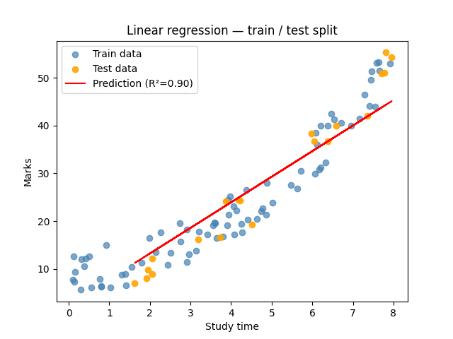
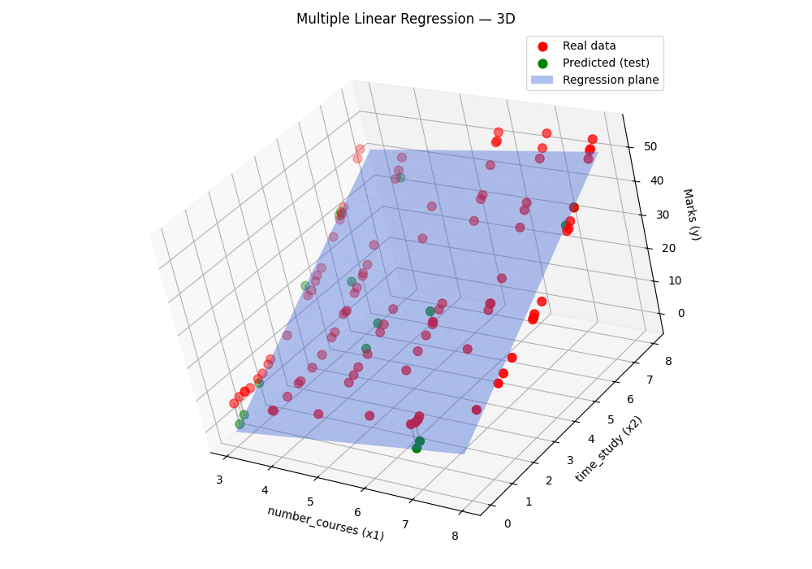
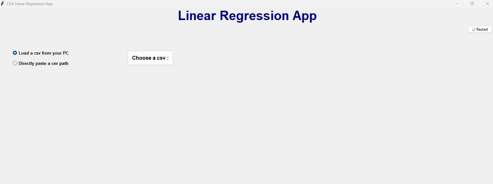
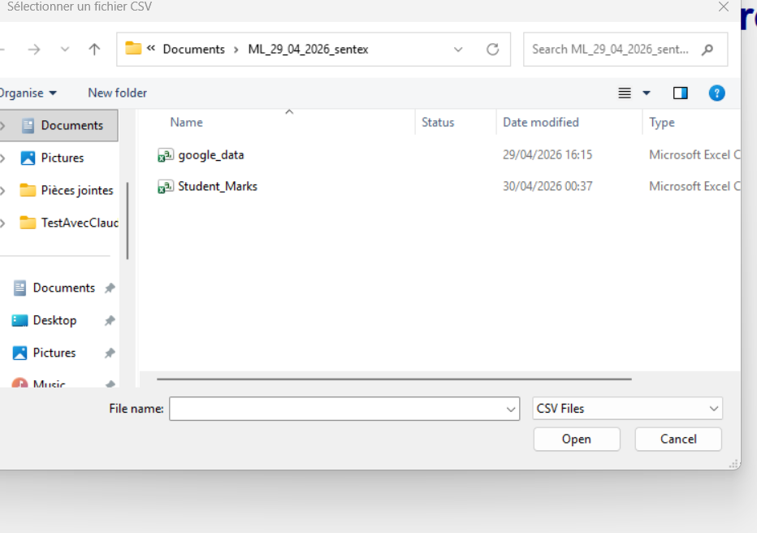
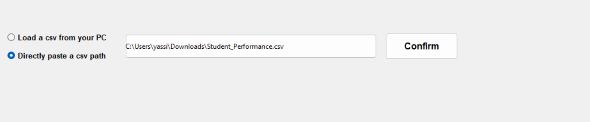
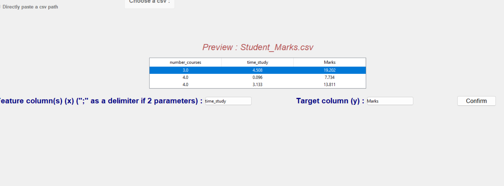
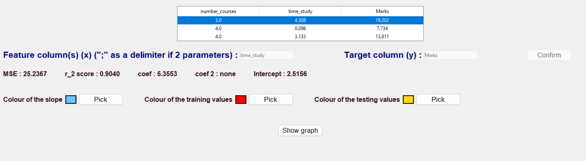
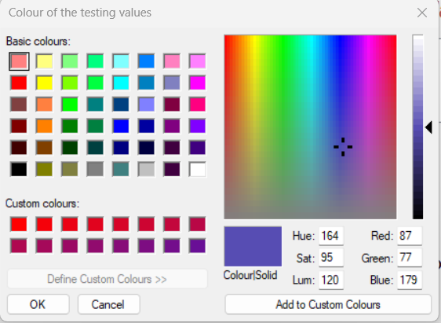
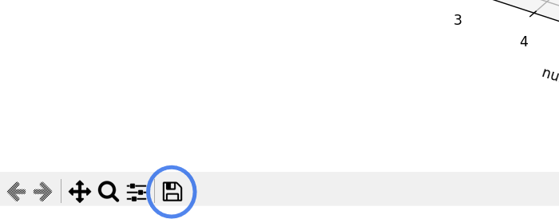

# Linear Regression App
A small application that allows you to **visualise linear regression** with a CSV file. 


## Before Getting Started

>The purpose of linear regression is to predict **the value of something** (often represented on the *y-axis*) using **one or more parameters** (often represented on the *x-axis*).



>- The slope is the regression line shown in red.
>- The intercept is the value of the y-axis when x = 0.

>As we can see here, we can somehow predict a student's mark based on their study hours.

We can even add another parameter and represent the regression using a three-dimensional graph, like this:


## Features :


* Can load a CSV file ;
* Preview dataset columns ;
* Choose the column you want to predict (y);
* Choose the Select independent variables (features/parameters) ;
* Customise visualisation settings ;
* Display the final graph ; 
* A restart button on the left.


## How to utilise it :
### Lauch the application :
```bash
python main.py
```

### In the app :

#### Chose a CSV file :
* You need to either choose a CSV file through the "choose CSV" button or paste a CSV-file path by clicking on to the second RadioButton. :
 


 


Or :


 

#### Insert the independant varables :
Now that the CSV file is loaded, let's **insert the independent variables** (The column(s) which will predict the *Y axis*), you could be based on the CSV preview ; when you have finished, click on the **"confirm"** button ! :


    *Note that string values are not valid and will raise an error*

#### Setting the colour of the graph's features :
Afterwards, let's set the colours of our future graph :


    You just have to click on the "pick" button and choose the colour like that.

> **Please note that you can access all the necessary information about the linear regression training.**
>
> - The coefficient (coef) represents how much the marks increase when the study time increases by 1 unit.
> - The R² score indicates how accurate the model is. Here, a score of 0.904 means the model is fairly accurate.  
>   - 0 = useless model  
>   - 1 = perfect model
> - The MSE (*Mean Squared Error*) represents the average squared error between the predicted values and the real values. Lower is better.
> If you ever want to explore that further, I recommand taking a look at scikit-learn's documentation. Nevertheless, the material is presented in a highly detailed manner, and you'd better have a solid grasp of the fundamentals of mathematics.
> https://scikit-learn.org/stable/getting_started.html


#### Displaying the graph : 
>* Once you have finished setting the colours, you can press the 'Confirm' button to display the graph.
>*Please note that you needn't press the "Confirm" button if the graph is already displayed, as it is not possible to display two graphs at the same time.*

##### Small example (Image at the beggining):


### Downloading the graph :
If you want to download the graph by any chance, click on the button at the bottom of the graph :


## Requirements :
> - Python 3.11+
> - Scikit-learn: The module used to train models and make predictions. 
> - Matplotlib (.pyplot): The module used to plot and visualise data.
> - Pandas: Handles data easily with just a few lines of code.
> - NumPy: Used for faster numerical calculations. 
>
> We can all see that it's too much. Fortunately, you can download everything at once using the terminal command : 
>```bash
>pip install -r requirements.txt
>```
> If you ever use the python launcher (for windows), as I do ; you will have to run this command :
>```bash
>py -(the_version) -m pip install -r requirements.txt
>```
> 


## How it works :
### The structure/tree


```text
|   .gitignore
|   main.py
|   README.md
|   requirements.txt
|
+---core
|   |   data.py
|   |   model.py
|   |   __init__.py
|   |
|   \---__pycache__
|           data.cpython-314.pyc
|           model.cpython-314.pyc
|           __init__.cpython-314.pyc
|
+---images
|       Choose_colour.png
|       Choose_csv.png
|       Figure_1.png
|       Figure_2.png
|       File_explorer.png
|       image.png
|       image_teminal.png
|       Path_pasting.png
|       Selecting_columns.png
|       Show_colours.png
|
\---ui
    |   app.py
    |   plot.py
    |   __init__.py
    |
    \---__pycache__
            app.cpython-314.pyc
            plot.cpython-314.pyc
            __init__.cpython-314.pyc
```

### What does each file do?
> - **data.py** handles everything related to the dataset : loading the CSV, dropping rows with missing values, validating and extracting the feature/target columns, and detecting non-numeric columns.
> - **model.py** trains a linear regression model on the data, evaluates it (R2, MSE), and has a method for predictining values you enter yourself.
> - **plot.py** is used to draw graphs. It can also identify whether a graph is two-dimensional or three-dimensional.
> - **app.py** — the core of the application. It builds the entire tkinter(ttk) interface, handles user interactions, and coordinates `data.py` and `model.py` to load data, train the model, and display the results by using `plot.py`.    
> - The **images** file is used to save the images shown in this README.
> - All files in both `_pycache_` are not imporant, don't consider them.
> - **main.py** is basically for linking the files in the UI folder to the files in the core folder.
> - The **.gitignore** file is used for hiding files. In this case : `_pycache_`.
> - **CHANGELOG.md** shows all the changes made when moving to a new version.
> - **README.md** is simply this file.
> - Both **__init__** files allow **main.py** to communicate with the files inside the **ui** and **core** folders.
> - You can see a quick descrption of all of the functions in the code as well.

## Future improvements

> - A better interface.
> - A prediction input enter any value and get an instant estimate from the trained model.
> - Support for more than 2 features.
> - Export the graph as an image.
> - Display a residuals plot.


# Linear Regression App (In french) :
Une petite application qui permet de **visualiser une régression linéaire** à partir d'un fichier CSV.
 
## Avant de commencer
 
> L'objectif de la régression linéaire est de prédire **la valeur de quelque chose** (souvent représentée sur l'*axe y*) à partir **d'un ou plusieurs paramètres** (souvent représentés sur l'*axe x*).
 

 
> - La pente est la droite de régression affichée en rouge.
> - L'ordonnée à l'origine est la valeur de l'axe y lorsque x = 0.
 
> Comme on peut le voir ici, on peut estimer la note d'un élève en fonction de son temps d'étude.
 
On peut même ajouter un deuxième paramètre et représenter la régression sur un graphique en trois dimensions :
 

 
## Fonctionnalités
 
* Chargement d'un fichier CSV ;
* Aperçu des colonnes du jeu de données ;
* Choix de la colonne à prédire (y) ;
* Choix des variables indépendantes (features/paramètres) ;
* Personnalisation des couleurs du graphique ;
* Affichage du graphique final ;
* Bouton de redémarrage.
## Comment l'utiliser
 
### Lancer l'application
 
```bash
python main.py
```
 
### Dans l'application
 
#### Choisir un fichier CSV
 
Vous devez soit choisir un fichier CSV via le bouton "Choose CSV", soit coller un chemin de fichier CSV en cliquant sur le deuxième RadioButton :
 

 

Ensuite :



 
Ou :
 

 
#### Renseigner les variables indépendantes
 
Une fois le fichier CSV chargé, **renseignez les variables indépendantes** (les colonnes qui serviront à prédire l'*axe Y*). Vous pouvez vous appuyer sur l'aperçu du CSV. Une fois terminé, cliquez sur le bouton **"Confirm"** :
 

 
*Note : les colonnes contenant des valeurs textuelles ne sont pas valides et déclencheront une erreur.*
 
#### Paramétrer les couleurs du graphique
 
Définissez ensuite les couleurs des éléments du graphique :
 

 
Il vous suffit de cliquer sur le bouton "Pick" et de choisir la couleur souhaitée.
 
> **Les métriques du modèle sont également affichées :**
>
> - Le coefficient (coef) représente de combien les notes augmentent quand le temps d'étude augmente d'une unité.
> - Le score R² indique la précision du modèle. Un score de 0.904 signifie que le modèle est relativement précis.
>   - 0 = modèle inutile
>   - 1 = modèle parfait
> - Le MSE (*Mean Squared Error* / erreur quadratique moyenne) représente l'erreur moyenne au carré entre les valeurs prédites et les valeurs réelles. Plus il est faible, mieux c'est.
>
> Pour aller plus loin, vous pouvez consulter la documentation de scikit-learn. Attention toutefois : vous feriez mieux d'avoir une compréhension assez solide en mathématiques.
> https://scikit-learn.org/stable/getting_started.html
 

 
#### Afficher le graphique
 
> * Une fois les couleurs définies, appuyez sur le bouton "Show graph" pour afficher le graphique.
> * *Please note that you needn't press the "Confirm" button if the graph is already displayed, as it is not possible to display two graphs at the same time.*
 
##### Exemple (image du début) :
 

 
### Télécharger le graphique
 
Pour télécharger le graphique, cliquez sur le bouton en bas de la fenêtre du graphique :
 

 
## Prérequis
 
> - Python 3.11+
> - Scikit-learn : le module utilisé pour entraîner les modèles et faire des prédictions.
> - Matplotlib (.pyplot) : le module utilisé pour tracer et visualiser les données.
> - Pandas : gère les données facilement en quelques lignes de code.
> - NumPy : utilisé pour des calculs numériques plus rapides.
>
> Tout peut être installé en une seule commande :
> ```bash
> pip install -r requirements.txt
> ```
> Si, comme moi, vous utilisez le lanceur Python (Python Launcher) (sous Windows)  :
> ```bash
> py -(version) -m pip install -r requirements.txt
> ```
> 
 
## Fonctionnement
 
### Structure du projet
 
```text
|   .gitignore
|   main.py
|   README.md
|   requirements.txt
|
+---core
|   |   data.py
|   |   model.py
|   |   __init__.py
|   |
|   \---__pycache__ 
|           data.cpython-314.pyc
|           model.cpython-314.pyc
|           __init__.cpython-314.pyc
|
+---images
|       Choose_colour.png
|       Choose_csv.png
|       Figure_1.png
|       Figure_2.png
|       File_explorer.png
|       image.png
|       image_teminal.png
|       Path_pasting.png
|       Selecting_columns.png
|       Show_colours.png
|
\---ui
    |   app.py
    |   plot.py
    |   __init__.py
    |
    \---__pycache__
            app.cpython-314.pyc
            plot.cpython-314.pyc
            __init__.cpython-314.pyc
```
 
### Rôle de chaque fichier
 
> - **data.py** — gère tout ce qui concerne le dataset (plus litteralement : jeu de données) : chargement du CSV, suppression des lignes avec des valeurs manquantes, validation et extraction des colonnes features/cible, détection des colonnes non numériques.
> - **model.py** — entraîne un modèle de régression linéaire, l'évalue (R², MSE), et dispose d'une méthode pour prédire des valeurs saisies manuellement.
> - **plot.py** — trace les graphiques. Identifie automatiquement si la régression doit être affichée en 2D ou en 3D.
> - **app.py** — le cœur de l'application. Construit toute l'interface tkinter/ttk, gère les interactions utilisateur, et coordonne `data.py`, `model.py` et `plot.py`.
> - **main.py** — point d'entrée, relie les fichiers de `ui/` à ceux de `core/`.
> - **images/** — contient les captures d'écran utilisées dans ce README.
> - **.gitignore** — exclut les dossiers `__pycache__` du dépôt Git.
> - **CHANGELOG.md** indique tous les changements effectués à chaque changement de version.
> - **README.md** est tout simplement ce fichier.
> - Les deux fichiers **__init__**  permettent que **main.py** communique avec les fichiers : **ui** et **core**.
> - Vous pouvez également appercevoir une brève description de chaque fonction dans le code.


 
## Améliorations futures
 
> - Une meilleure interface.
> - Un champ de prédiction : entrez n'importe quelle valeur pour obtenir une estimation instantanée du modèle entraîné. (Méthode déjà faite : il faut juste la mettre dans l'interface)
> - Support de plus de 2 features.
> - Export du graphique en image.
> - Affichage d'un graphique des résidus.
 

